# Browser Agent for Shopping

A multi-agent e-commerce browser automation and product analysis platform. Built as a learning project, this system tests and demonstrates various visual control, automation, and decision-making techniques that an autonomous agent can perform inside a live browser session.

This project extends the Directed Acyclic Graph (DAG) multi-agent orchestrator from [Shopping-Agent-V3-with-DAG](https://github.com/pradeepelavarasan/Shopping-Agent-V3-with-DAG) with an interactive, multi-layered Playwright browser-driving cascade.

---

## DAG-Based Architecture

This system inherits and expands upon the robust concurrent DAG (Directed Acyclic Graph) architecture of the original [Shopping-Agent-V3-with-DAG](https://github.com/pradeepelavarasan/Shopping-Agent-V3-with-DAG).

1. **Planner**: Receives the user query, decides the execution plan, and compiles the graph structure.
2. **Browser (Search, Filter, & Extraction)**: Handles the initial browser navigation, search queries, applying filters (like delivery checkboxes or discount links) on the e-commerce site, and extracting the raw product listing data.
3. **Product Shortlister**: Focuses purely on ranking and compiling the top shortlisted candidates from the extracted product listings.
4. **Critic**: Evaluates and validates the shortlister's candidates and execution path to ensure query alignment, just as seen in our transaction logs.
5. **Browser (Deep Scrape)**: Handles browser execution to concurrently scrape specific product detail pages, reviews, and images for the shortlisted items.
6. **Product Analyst**: Evaluates candidate items by analyzing detailed specifications and reviews retrieved by the browser.
7. **Product Recommendation**: Aggregates analyst reports, evaluates product trade-offs across the five core evaluation dimensions, and selects the top recommendation.
8. **Formatter**: Structures and emits the final JSON matching the target schema.

---

## Browser Agent Cascade (Four Parts)

To interact with pages, the Browser Agent utilizes a highly optimized four-layered cascade, dynamically escalating from the most cost-effective method to the most advanced visual model depending on task complexity and page responsiveness:


### Part 1: Layer 1: HTML Extraction (Trafilatura)
* **Description**: Static HTTP GET request using `httpx` and parsed using `trafilatura`.
* **Cost**: Negligible (no LLM calls, minimal latency).
* **Usage**: Ideal for read-only pages, product detail extraction where all text is pre-rendered in the static HTML, or basic link harvesting.

### Part 2: Layer 2a: Deterministic Selectors
* **Description**: Programmatic selectors supplied by the planner to click or fill simple elements via Playwright.
* **Cost**: Negligible.
* **Usage**: Best for pre-defined button clicks (like sign-in or navigating to a known endpoint) without needing LLM reasoning.

### Part 3: Layer 2b: Accessibility (A11y) Tree Driver
* **Description**: The browser's active Accessibility Tree is extracted, structured, and presented to an LLM as a text representation of interactive elements (`[id]<tag role="role">name</tag>`).
* **Cost**: Moderate (standard text-only LLM context).
* **Usage**: Suitable for clean, semantic layouts where checkboxes, inputs, and links can be identified solely by their text labels.

### Part 4: Layer 3: Set-of-Marks (SoM) Vision Driver
* **Description**: Playwright captures a live screenshot of the page, overlays numbered interactive boxes (marks) over elements, and feeds the image to a visual LLM along with a text legend.
* **Cost**: High (Vision model reasoning).
* **Usage**: Essential for highly dynamic, non-standard, or complex layouts where elements are overlapping, interactive elements are unlabelled, or visual context (like popovers and ads) is required.

---

## Interactive Examples

We showcase the browser agent's capabilities across three interactive example runs, demonstrating different UI interaction types on Amazon India:
1. **Checkbox-based delivery selection** (Fossil Women's Watch - "Get It Today/Tomorrow" filter)
2. **Link-based discount filters** (Kids Tricycle - "25% Off or more" filter)
3. **Dropdown-based sort selections** (Smart Watches - "Best Sellers" sort)

---

### 1. Checkbox-Based Delivery Selection

#### Initial State
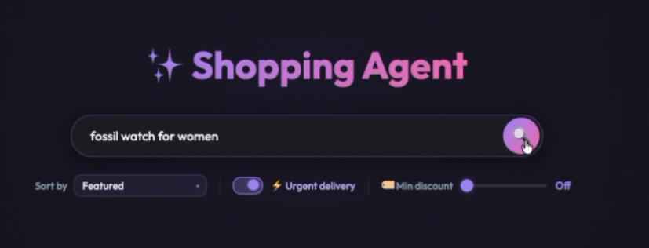

#### Execution Log & DAG

#### Session Log: s9-2026-06-13_04-56-56

##### 1. Original User Goal
> fossil watch for women. Additional filters: filter by "Get It Today" or "Get It by Tomorrow".

##### 2. Planner DAG
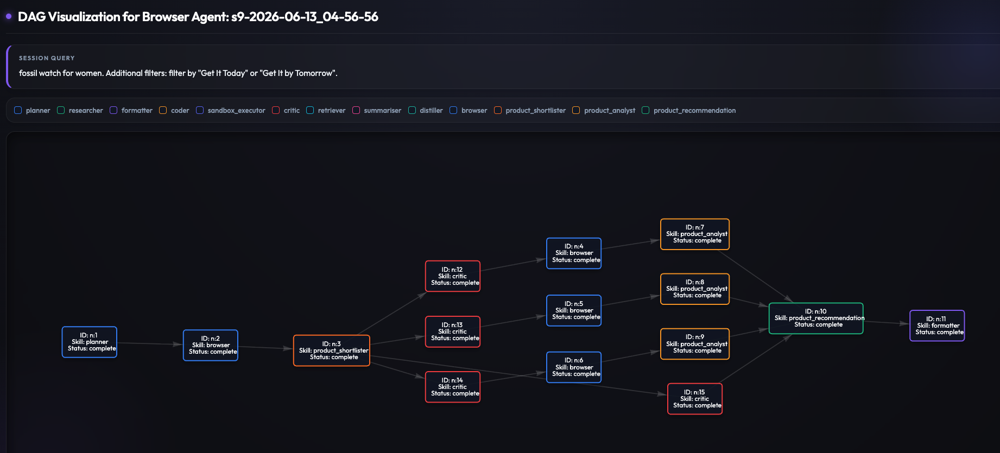

##### 3. Browser Path Chosen
The Browser cascade chose the **VISION** interaction path.

##### 4. Browser Actions & Screenshots

###### Turn 1
**Thinking:** 

**Actions:**
- `click(mark=81)`

**Outcome:** `ok`

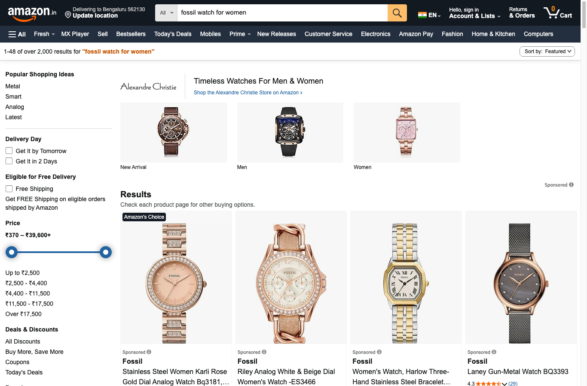

###### Turn 2
**Thinking:** 

**Actions:**
- `wait(seconds=5)`

**Outcome:** `ok`

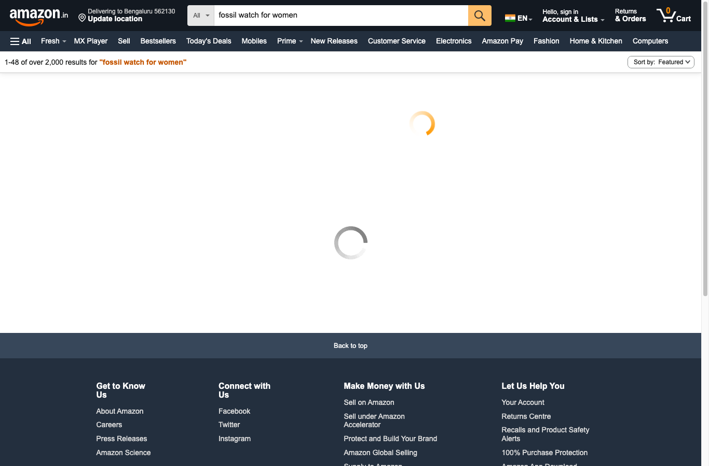

###### Turn 3
**Thinking:** 

**Actions:**
- `done(success=True, value=[{"asin": "B00M7NEN1U", "title": "Fossil Virginia Rose Gold Watch ES3716", "price": "₹13,495", "rating": "4.3", "reviews_count": "2,417", "image_url": "https://m.media-amazon.com/images/I/712OfcV350L._AC_UL320_.jpg"}, {"asin": "B0D93652ZY", "title": "Women's Watch, Harlow Three-Hand Stainless Steel Bracelet Watch for Women", "price": "₹13,495", "rating": "4.8", "reviews_count": "74", "image_url": "https://m.media-amazon.com/images/I/71+M2oYhO0L._AC_UL320_.jpg"}])`

**Outcome:** `done(True)`

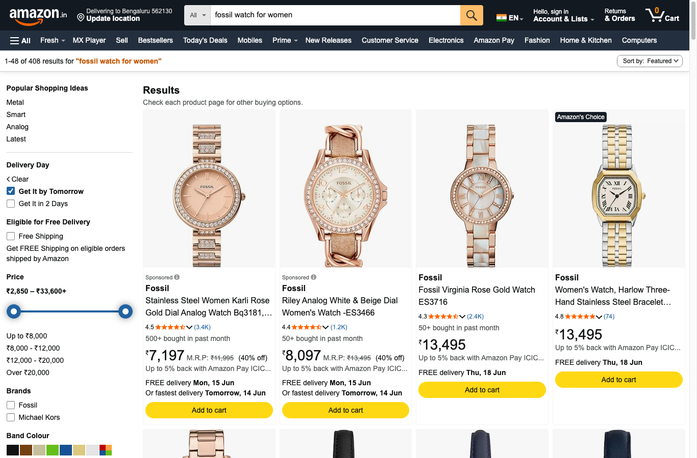

##### 5. Extracted Shortlist Data

```json
{
  "products": [
    {
      "id": "B004D4S7AY",
      "title": "Analog Gold Dial Women's Watch - ES2811",
      "price": "₹13,495",
      "rating": 4.4,
      "reviews_count": 6700,
      "image_url": "https://m.media-amazon.com/images/I/71CCvrJ5JBL._AC_UL320_.jpg",
      "url": "https://www.amazon.in/dp/B004D4S7AY"
    },
    {
      "id": "B00M7NEN1U",
      "title": "Fossil Virginia Rose Gold Watch ES3716",
      "price": "₹13,495",
      "rating": 4.3,
      "reviews_count": 2400,
      "image_url": "https://m.media-amazon.com/images/I/712OfcV350L._AC_UL320_.jpg",
      "url": "https://www.amazon.in/dp/B00M7NEN1U"
    },
    {
      "id": "B075QDQFB5",
      "title": "Fossil Analog Rose Gold Dial Women's Watch-ES4318",
      "price": "₹12,995",
      "rating": 4.5,
      "reviews_count": 2500,
      "image_url": "https://m.media-amazon.com/images/I/7101ZdCerlL._AC_UL320_.jpg",
      "url": "https://www.amazon.in/dp/B075QDQFB5"
    }
  ]
}
```

##### 6. Browser path chosen for product analyst

###### Product detail lookup for [https://www.amazon.in/dp/B004D4S7AY](https://www.amazon.in/dp/B004D4S7AY) (ASIN: B004D4S7AY)
- **Node ID:** `n:4`
- **Interaction Path:** **EXTRACT**

####### Extracted Content:
```text
Case diameter
38 Millimetres
Band colour
Gold
Band material type
Stainless Steel
Warranty type
Manufacturer
Watch movement type
Quartz
Item weight
50 Grams
Country of Origin
China
About this item
- Dial Color: Gold, Case Shape: Round, Dial Glass Material: Mineral
- Band Color: Gold, Band Material: Stainless Steel
- Watch Movement Type: Quartz, Watch Display Type: Analog
- Case Material: Stainless Steel, Case Diameter: 38 millimeters, Stainless Steel Bezel
- Water Resistance Depth: 100 meters, Double Locking Fold-Over Clasp
- 2 years warranty
Additional Information
Manufacturer
Fossil India Pvt Ltd
Packer
Fossil
Item Dimensions LxWxH
15 x 15 x 15 Millimeters
Net Quantity
1.00 Count
Generic Name
WATCH

=== EXTRACTED LINKS & IMAGES ===
[Link] text='Main content' href='#skippedLink' imgUrl=''
[Link] text='About this item' href='#featurebullets_feature_div' imgUrl=''
[Link] text='About this item' href='#nic-po-expander-heading' imgUrl=''
[Link] text='About this item' href='#productFactsDesktopExpander' imgUrl=''
[Link] text='Buying options' href='#buybox' imgUrl=''
[Link] text='Compare with similar items' href='#product-comparison_feature_div' imgUrl=''
[Link] text='Videos' href='#va-related-videos-widget_feature_div' imgUrl=''
[Link] text='Reviews' href='#customerReviews' imgUrl=''
[Link] text='Search                          alt               +               /' href='javascript:void(0)' imgUrl=''
[Link] text='Cart                          shift               +               alt'

... (truncated for length)
```

###### Product detail lookup for [https://www.amazon.in/dp/B00M7NEN1U](https://www.amazon.in/dp/B00M7NEN1U) (ASIN: B00M7NEN1U)
- **Node ID:** `n:5`
- **Interaction Path:** **EXTRACT**

####### Extracted Content:
```text
Add to your order
[Servify Care 1 Year Extended Warranty for Watches Between 10001-15000 (Email Delivery, No Physical Kit)](/dp/B0H26VMK6Q/ref=dp_atch_dss_w_lm_B00M7NEN1U_B0H26VMK6Q)
from Service Lee Technologies Pvt. Ltd ₹449.00
- Validity : Extended Warranty will start after the Brand warranty ends & continues for 1 year/ 2 years as per plan.
- For your comfort : - Digital Delivery of the plan in your registered e-mail within 24 hours
- What is Covered?:- Any mechanical or, electrical breakdown/defects to the covered product to the extent provided by the Manufacturer's Warranty including the cost of parts and labour for the products manufactured
- What's not covered : (a) any Accidental or Liquid damage (b) Damage caused by unauthorized repairs (c) Accessories, Consumables or parts that are not covered under the standard Brand warranty
- How to raise a claim - Schedule a service at your convenience from your Amazon account itself by navigating to Your Orders section in your Amazon account > go to the product order > click on Get Product Support > schedule an appointment.
- Support Contact Details: 1. Customer Service Number: 1800 123 333 888 (Toll Free) (Monday – Saturday) (10 AM to 7 PM) 2. Customer Support Email ID: support@servify.com
[Learn more](/dp/B0H26VMK6Q/ref=dp_atch_dss_w_lm_B00M7NEN1U_B0H26VMK6Q)
Fossil Virginia Rose Gold Watch ES3716
Offers
-
Cashback
Upto ₹374.00 cashback as Amazon Pay Balance when you pay with Amazon Pay ICICI Bank Credit Cards[1 offer](#)Ca

... (truncated for length)
```

###### Product detail lookup for [https://www.amazon.in/dp/B075QDQFB5](https://www.amazon.in/dp/B075QDQFB5) (ASIN: B075QDQFB5)
- **Node ID:** `n:6`
- **Interaction Path:** **EXTRACT**

####### Extracted Content:
```text
Add to your order
[Servify Care 1 Year Extended Warranty for Watches Between 10001-15000 (Email Delivery, No Physical Kit)](/dp/B0H26VMK6Q/ref=dp_atch_dss_w_lm_B075QDQFB5_B0H26VMK6Q)
from Service Lee Technologies Pvt. Ltd ₹449.00
- Validity : Extended Warranty will start after the Brand warranty ends & continues for 1 year/ 2 years as per plan.
- For your comfort : - Digital Delivery of the plan in your registered e-mail within 24 hours
- What is Covered?:- Any mechanical or, electrical breakdown/defects to the covered product to the extent provided by the Manufacturer's Warranty including the cost of parts and labour for the products manufactured
- What's not covered : (a) any Accidental or Liquid damage (b) Damage caused by unauthorized repairs (c) Accessories, Consumables or parts that are not covered under the standard Brand warranty
- How to raise a claim - Schedule a service at your convenience from your Amazon account itself by navigating to Your Orders section in your Amazon account > go to the product order > click on Get Product Support > schedule an appointment.
- Support Contact Details: 1. Customer Service Number: 1800 123 333 888 (Toll Free) (Monday – Saturday) (10 AM to 7 PM) 2. Customer Support Email ID: support@servify.com
[Learn more](/dp/B0H26VMK6Q/ref=dp_atch_dss_w_lm_B075QDQFB5_B0H26VMK6Q)
Fossil Analog Rose Gold Dial Women's Watch-ES4318
Offers
-
Cashback
Upto ₹389.00 cashback as Amazon Pay Balance when you pay with Amazon Pay ICICI Bank Credit Cards[1

... (truncated for length)
```


##### 7. Final Recommendation Matrix


Product | Price | Rating | CUSTOMER SENTIMENT | RELIABILITY | VALUE FOR MONEY | FEATURE COMPLETENESS | BUILD QUALITY
--- | --- | --- | --- | --- | --- | --- | ---
**[Analog Gold Dial Women's Watch - ES2811](https://www.amazon.in/dp/B004D4S7AY)** | ₹13,495 | 4.4 (6,700 reviews) | **[POSITIVE]** Predominantly positive with a 4.4-star rating from 6,757 reviews. Customers frequently describe the watch as elegant, functional, and good value, though some isolated negative feedback exists. | **[POSITIVE]** The product is backed by a 2-year manufacturer warranty and sold by a recognized brand (Fossil). No significant reports of premature failure are highlighted in the provided review snippets. | **[POSITIVE]** Reviewers explicitly mention the product as 'value for money.' It offers a branded stainless steel design at a mid-range price point, which users find appropriate for the quality provided. | **[POSITIVE]** The watch includes standard features for the category: quartz movement, stainless steel construction, and 100m water resistance. It meets typical expectations for an analog fashion watch. | **[POSITIVE]** Constructed with stainless steel casing and band, mineral glass, and a double-locking clasp. The 50g weight and material specifications indicate a durable, standard build for a fashion timepiece.
**[Fossil Analog Rose Gold Dial Women's Watch-ES4318](https://www.amazon.in/dp/B075QDQFB5)** | ₹12,995 | 4.5 (2,500 reviews) | **[POSITIVE]** Predominantly positive. Customers praise the aesthetic design, calling it 'cute' and 'eye-pleasing'. Some minor criticism regarding packaging and a magnifying glass over the date feature. | **[POSITIVE]** Fossil is a well-known brand. The product includes a 2-year manufacturer warranty and clear instructions for registration and service, indicating a standard, reliable support structure. | **[POSITIVE]** Reviewers explicitly mention it is 'worth the money'. The price point is supported by the brand reputation, stainless steel materials, and included warranty coverage. | **[POSITIVE]** Standard analog quartz watch features are present, including water resistance (50m) and stainless steel construction. No notable omissions for this category of fashion watch. | **[POSITIVE]** Constructed with stainless steel for both the case and band. Reviews confirm the product matches the photos and is perceived as high quality, despite one report of a dented tin box.
**[Fossil Virginia Rose Gold Watch ES3716](https://www.amazon.in/dp/B00M7NEN1U)** | ₹13,495 | 4.3 (2,400 reviews) | **[POSITIVE]** Reviews are generally positive (4.3 stars). Customers praise the design, quality, and value, though some note the dial is smaller than expected and one reported a functional issue. | **[POSITIVE]** The product includes a 2-year international manufacturer warranty and clear instructions for service, indicating a standard, reliable support structure for a major brand. | **[POSITIVE]** Priced at ₹12,495, customers frequently describe it as a high-quality, 'expensive-looking' product that is worth the cost, with several mentioning it makes for a great gift. | **[POSITIVE]** Standard feature set for a fashion watch: quartz movement, 30m water resistance, and adjustable bracelet. It lacks a date window, which is a noted omission for some users. | **[POSITIVE]** Constructed with stainless steel and mineral crystal. Reviews describe it as 'solid' and 'well-made,' though one user mentioned the band feels lighter than previous models.

**Overall Agent Recommendation Summary:**
> The Analog Gold Dial Women's Watch - ES2811 is the top recommendation due to its exceptional customer reach and high volume of positive feedback, boasting over 6,700 reviews. It outperforms the other models by offering superior water resistance and a robust, proven track record of reliability and build quality that users consistently praise.

##### 8. Cost & Performance Summary

| Node ID | Skill | Provider | Model | Latency | Tokens In | Tokens Out |
|---|---|---|---|---|---|---|
| n:1 | planner | gemini_lite_3 | gemini-3.1-flash-lite | 2,799ms | 4,679 | 712 |
| n:2 | browser | gemini_lite_3, gemini_lite_4 | gemini-3.1-flash-lite | 29,872ms | 104,892 | 1,777 |
| n:3 | product_shortlister | gemini_lite_3, gemini_lite_4, gemini_lite_5, gemini_lite_6, gemini_lite_7 | gemini-3.1-flash-lite | 2,156ms | 70,925 | 926 |
| n:4 | browser | gemini_lite_3, gemini_lite_4, gemini_lite_5, gemini_lite_6, gemini_lite_7 | gemini-3.1-flash-lite | 1,887ms | 23,481 | 531 |
| n:5 | browser | gemini_lite_3, gemini_lite_4, gemini_lite_5, gemini_lite_6, gemini_lite_7 | gemini-3.1-flash-lite | 2,292ms | 83,384 | 977 |
| n:6 | browser | gemini_lite_3, gemini_lite_4, gemini_lite_5, gemini_lite_6, gemini_lite_7 | gemini-3.1-flash-lite | 2,070ms | 23,481 | 531 |
| n:7 | product_analyst | gemini_lite_3 | gemini-3.1-flash-lite | 2,073ms | 21,015 | 325 |
| n:8 | product_analyst | gemini_lite_3 | gemini-3.1-flash-lite | 3,082ms | 21,015 | 325 |
| n:9 | product_analyst | gemini_lite_3, gemini_lite_4 | gemini-3.1-flash-lite | 183,044ms | 82,383 | 1,008 |
| n:10 | product_recommendation | gemini_lite_3, gemini_lite_4 | gemini-3.1-flash-lite | 3,979ms | 26,817 | 2,186 |
| n:11 | formatter | gemini_lite_3, gemini_lite_4 | gemini-3.1-flash-lite | 1,813ms | 5,802 | 1,861 |
| n:12 | critic | gemini_lite_3, gemini_lite_4, gemini_lite_5, gemini_lite_6, gemini_lite_7 | gemini-3.1-flash-lite | 889ms | 66,231 | 631 |
| n:13 | critic | gemini_lite_3, gemini_lite_4, gemini_lite_5, gemini_lite_6, gemini_lite_7 | gemini-3.1-flash-lite | 997ms | 66,231 | 631 |
| n:14 | critic | gemini_lite_3, gemini_lite_4, gemini_lite_5, gemini_lite_6, gemini_lite_7 | gemini-3.1-flash-lite | 953ms | 66,231 | 631 |
| n:15 | critic | gemini_lite_3, gemini_lite_4, gemini_lite_5, gemini_lite_6, gemini_lite_7 | gemini-3.1-flash-lite | 886ms | 66,231 | 631 |
| **TOTAL** | | | | **238,793ms** | **732,798** | **13,683** |


#### Final Output State
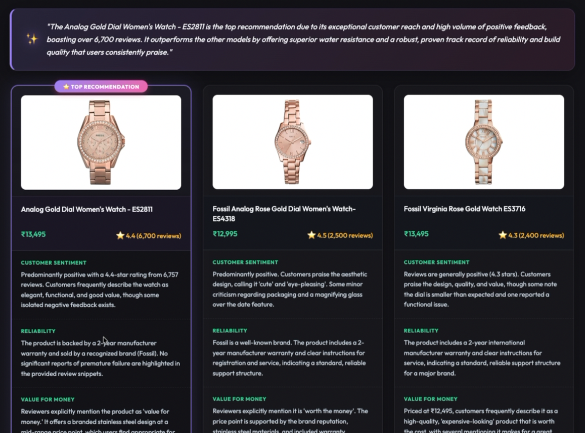

---

### 2. Link-Based Discount Filters

#### Initial State
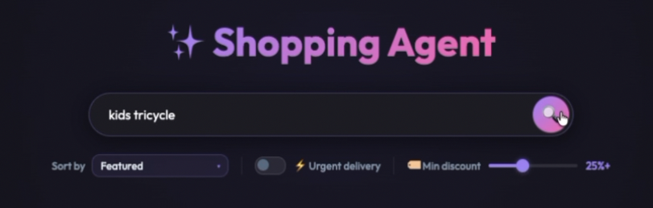

#### Execution Log & DAG

#### Session Log: s9-2026-06-13_05-43-40

##### 1. Original User Goal
> kids tricycle. Additional filters: filter by "25% Off or more".

##### 2. Planner DAG
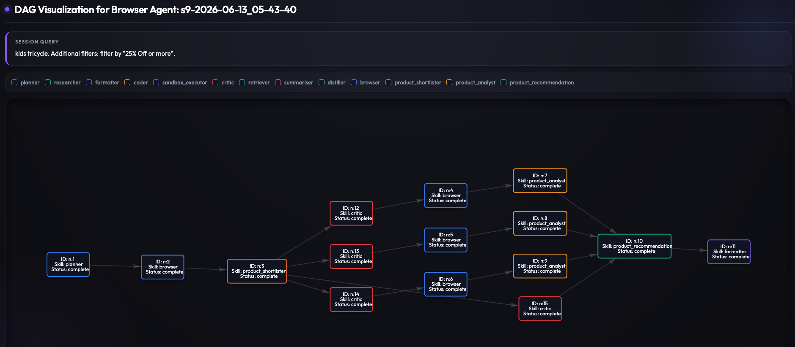

##### 3. Browser Path Chosen
The Browser cascade chose the **VISION** interaction path.

##### 4. Browser Actions & Screenshots

###### Turn 1
**Thinking:** 

**Actions:**
- `scroll(direction=down, value=500)`

**Outcome:** `ok`

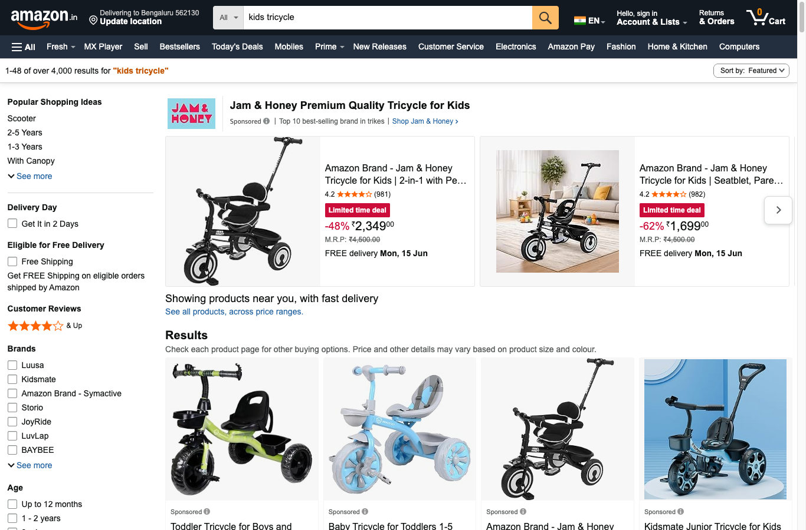

###### Turn 2
**Thinking:** 

**Actions:**
- `scroll(direction=down, mark=56)`

**Outcome:** `ok`

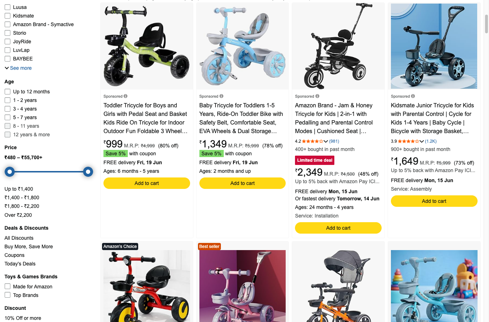

###### Turn 3
**Thinking:** 

**Actions:**
- `click(mark=42)`

**Outcome:** `ok`

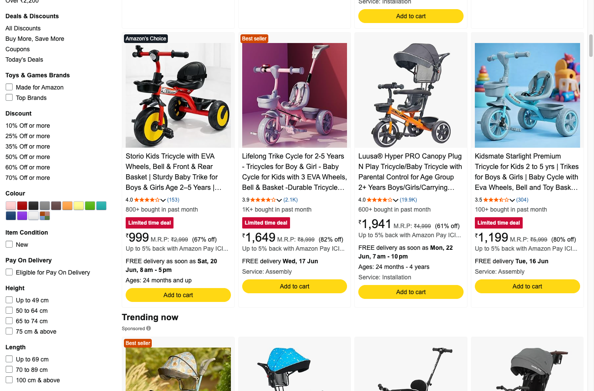

###### Turn 4
**Thinking:** 

**Actions:**
- `scroll(direction=up, value=1000)`

**Outcome:** `ok`


###### Turn 5
**Thinking:** 

**Actions:**
- `scroll(direction=down, mark=47)`

**Outcome:** `ok`

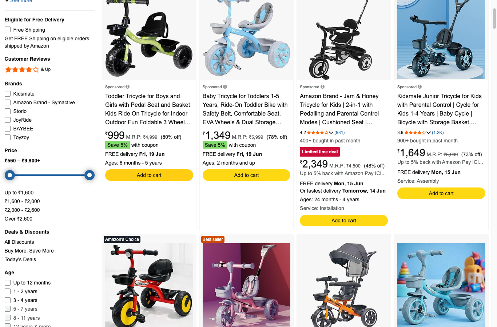

###### Turn 6
**Thinking:** 

**Actions:**
- `done(success=True, value=The filter '25% Off or more' has been applied. The page now displays the filtered product listings.)`

**Outcome:** `done(True)`

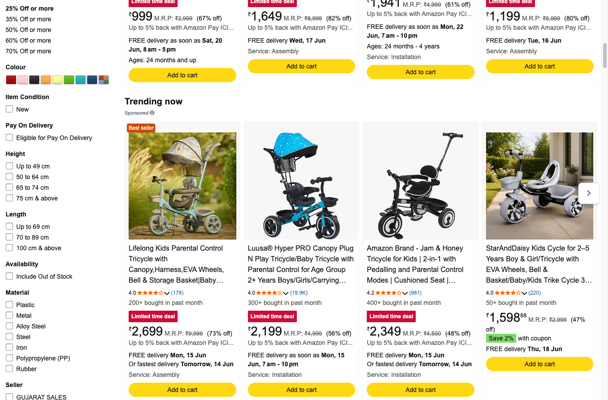

##### 5. Extracted Shortlist Data

```json
{
  "products": [
    {
      "id": "B0DRPGFDGJ",
      "title": "Luusa® Hyper PRO Canopy Plug N Play Tricycle/Baby Tricycle with Parental Control for Age Group 2+ Years Boys/Girls/Carrying Capacity Upto 30-KGS Proudly Made in India (Orange)",
      "price": "₹1,941",
      "rating": 4.0,
      "reviews_count": 19900,
      "image_url": "https://m.media-amazon.com/images/I/71nN8PW-TLL._AC_UL320_.jpg",
      "url": "https://www.amazon.in/dp/B0DRPGFDGJ"
    },
    {
      "id": "B0BCGB3XDW",
      "title": "LuvLap Sunny Ride on & Car for Kids with Music & Horn Steering, Push Car for Baby with Backrest, Safety Guard, Under Seat Storage & Big Wheels, Ride on for Kids 1 to 3 Years Upto 25 Kgs (Blue)",
      "price": "₹1,099",
      "rating": 4.1,
      "reviews_count": 14400,
      "image_url": "https://m.media-amazon.com/images/I/71zbet+NEPL._AC_UL320_.jpg",
      "url": "https://www.amazon.in/dp/B0BCGB3XDW"
    },
    {
      "id": "B08Z43PBNX",
      "title": "JoyRide Learn-To-Ride Trike On 3 Wheels With Safety Harness, Non-Slip Pedal,Storage Basket And Removable Parent Handle Green, Kids",
      "price": "₹2,212",
      "rating": 4.0,
      "reviews_count": 2800,
      "image_url": "https://m.media-amazon.com/images/I/7170tAI+kAL._AC_UL320_.jpg",
      "url": "https://www.amazon.in/dp/B08Z43PBNX"
    }
  ]
}
```

##### 6. Browser path chosen for product analyst

###### Product detail lookup for [https://www.amazon.in/dp/B0DRPGFDGJ](https://www.amazon.in/dp/B0DRPGFDGJ) (ASIN: B0DRPGFDGJ)
- **Node ID:** `n:4`
- **Interaction Path:** **EXTRACT**

####### Extracted Content:
```text
Luusa® Hyper PRO Canopy Plug N Play Tricycle/Baby Tricycle with Parental Control for Age Group 2+ Years Boys/Girls/Carrying Capacity Upto 30-KGS Proudly Made in India (Orange)
Offers
-
Cashback
Upto ₹58.00 cashback as Amazon Pay Balance when you pay with Amazon Pay ICICI Bank Credit Cards[1 offer](#)Cashback
-
No Cost EMI
Upto ₹50.60 EMI interest savings on Amazon Pay ICICI Bank Credit Cards[1 offer](#)No Cost EMI
-
Bank Offer
Upto ₹2,500.00 discount on select Credit Cards[40 offers](#)Bank Offer
-
Partner Offers
Get GST invoice and save up to 18% on business purchases.[Sign up for free](/gp/b/ref=apay_upi_sopp?node=16179244031)[1 offer](#)Partner Offers
[Learn more](/gp/help/customer/display.html?nodeId=200534000)
10 days Service Centre Replacement
| Replacement Reason | Replacement Period | Replacement Policy |
|---|---|---|
| Defective Item | 10 days from delivery | Luusa warranty policy (at Service Centre) |
| Physical Damage, Wrong and Missing Item | 10 days from delivery | Replacement |
- Amazon may provide support via self-help guides or on call or at doorstep, as applicable.
- If this issue is not resolved, please contact Luusa or visit the Service Centre.
- Luusa will repair the product or provide a replacement or Defective certificate, as applicable. The time taken for resolution will be as per Luusa warranty policies.
- Please check for nearest Brand service center in your location. For details
[click here](https://www.amazon.in/gp/help/customer/display.html?ie=UTF

... (truncated for length)
```

###### Product detail lookup for [https://www.amazon.in/dp/B0BCGB3XDW](https://www.amazon.in/dp/B0BCGB3XDW) (ASIN: B0BCGB3XDW)
- **Node ID:** `n:5`
- **Interaction Path:** **EXTRACT**

####### Extracted Content:
```text
LuvLap Sunny Ride on & Car for Kids with Music & Horn Steering, Push Car for Baby with Backrest, Safety Guard, Under Seat Storage & Big Wheels, Ride on for Kids 1 to 3 Years Upto 25 Kgs (Blue)
Offers
-
Cashback
Upto ₹32.00 cashback as Amazon Pay Balance when you pay with Amazon Pay ICICI Bank Credit Cards[1 offer](#)Cashback
-
Bank Offer
Upto ₹2,500.00 discount on select Credit Cards[40 offers](#)Bank Offer
-
Partner Offers
Get GST invoice and save up to 18% on business purchases.[Sign up for free](/gp/b/ref=apay_upi_sopp?node=16179244031)[1 offer](#)Partner Offers
[Learn more](/gp/help/customer/display.html?nodeId=200534000)
10 days Replacement
| Replacement Reason | Replacement Period | Replacement Policy |
|---|---|---|
| Physical Damage, Defective, Wrong and Missing Item | 10 days from delivery | Replacement |
[Know More](javascript:void(0))
Replacement Instructions
[Read full returns policy](https://www.amazon.in/gp/help/customer/display.html/?ie=UTF8&nodeId=201149900)
All services are listed below
- Free installation and demo on Televisions. **Installation at the time of delivery available in select pincodes**
[View details](https://www.amazon.in/l/15353003031).Wall mount brackets are chargeable if not included in the box along with the TV - Free Phone set-up service at the time of delivery is available in select regions. This can be availed during checkout by selecting a time slot that mentions "with setup".
[View details](https://www.amazon.in/l/22827739031) - Free inst

... (truncated for length)
```

###### Product detail lookup for [https://www.amazon.in/dp/B08Z43PBNX](https://www.amazon.in/dp/B08Z43PBNX) (ASIN: B08Z43PBNX)
- **Node ID:** `n:6`
- **Interaction Path:** **EXTRACT**

####### Extracted Content:
```text
JoyRide Learn-To-Ride Trike On 3 Wheels With Safety Harness, Non-Slip Pedal,Storage Basket And Removable Parent Handle Green, Kids
Offers
-
Cashback
Upto ₹66.00 cashback as Amazon Pay Balance when you pay with Amazon Pay ICICI Bank Credit Cards[1 offer](#)Cashback
-
No Cost EMI
Upto ₹57.68 EMI interest savings on Amazon Pay ICICI Bank Credit Cards[1 offer](#)No Cost EMI
-
Bank Offer
Upto ₹2,500.00 discount on select Credit Cards[40 offers](#)Bank Offer
-
Partner Offers
Buy 2 or more and get 3% off on Qualifying Items offered by GUJARAT SALES[View products](/promotion/psp/A1YQHE97VE9GWZ?ref=psp_external&redirectAsin=B08Z43PBNX&redirectMerchantId=AE27XD84TPXHH)[2 offers](#)Partner Offers
[Learn more](/gp/help/customer/display.html?nodeId=200534000)
10 days Replacement
| Replacement Reason | Replacement Period | Replacement Policy |
|---|---|---|
| Physical Damage, Defective, Wrong and Missing Item | 10 days from delivery | Replacement |
[Know More](javascript:void(0))
Replacement Instructions
[Read full returns policy](https://www.amazon.in/gp/help/customer/display.html/?ie=UTF8&nodeId=201149900)
All services are listed below
- Free installation and demo on Televisions. **Installation at the time of delivery available in select pincodes**
[View details](https://www.amazon.in/l/15353003031).Wall mount brackets are chargeable if not included in the box along with the TV - Free Phone set-up service at the time of delivery is available in select regions. This can be availed during ch

... (truncated for length)
```


##### 7. Final Recommendation Matrix


Product | Price | Rating | CUSTOMER SENTIMENT | RELIABILITY | VALUE FOR MONEY | FEATURE COMPLETENESS | BUILD QUALITY
--- | --- | --- | --- | --- | --- | --- | ---
**[LuvLap Sunny Ride on & Car for Kids with Music & H...](https://www.amazon.in/dp/B0BCGB3XDW)** | ₹1,099 | 4.1 (14,400 reviews) | **[NEUTRAL]** Mixed. While many praise the quality and value, significant concerns exist regarding safety, specifically reports of the car tipping backward, and complaints about loud music and small seat size. | **[NEUTRAL]** The brand is established with 9+ years on Amazon, but user reports of assembly difficulties and stability issues suggest inconsistent long-term reliability for this specific model. | **[POSITIVE]** At a discounted price of ₹1,099, it is considered a fair purchase by many, though some reviewers feel the size is smaller than expected and the build quality is basic. | **[NEUTRAL]** Includes standard features like music, horn, backrest, and storage. However, some users report the horn is missing or the seat does not fix properly, indicating potential quality control gaps. | **[NEUTRAL]** Constructed from virgin PVC plastic. While some find it durable, others describe the material as light, clumsy plastic and report structural issues leading to instability.
**[Luusa® Hyper PRO Canopy Plug N Play Tricycle/Baby ...](https://www.amazon.in/dp/B0DRPGFDGJ)** | ₹1,941 | 4.0 (19,900 reviews) | **[NEUTRAL]** Mixed. While many praise the design and ease of use, significant complaints exist regarding poor welding, loose nuts/bolts, and defective wheel locking systems, leading to a 4.0-star rating. | **[NEGATIVE]** Concerns regarding long-term durability are raised by reports of rusting parts, loose hardware, and wheel detachment. Warranty is limited to 6 months on metal parts. | **[POSITIVE]** Priced at ₹1,941 (61% off), users generally find it a good value for toddlers, though some feel the material quality does not match the premium look shown in marketing images. | **[POSITIVE]** Includes essential features like a canopy, parental control handle, and safety belt. However, users noted the seat lacks cushioning and the included bell is of very low quality. | **[NEGATIVE]** Construction is inconsistent. While marketed as 'heavy duty' with 'zero edge design', multiple reviews cite poor welding, flimsy belt clips, and parts arriving with rust.
**[JoyRide Learn-To-Ride Trike On 3 Wheels With Safet...](https://www.amazon.in/dp/B08Z43PBNX)** | ₹2,212 | 4.0 (2,800 reviews) | **[NEUTRAL]** Mixed. While many praise the safety features and customer support, others report issues with assembly, missing manuals, and poor build quality, resulting in a 4.0-star rating. | **[NEUTRAL]** Concerns exist regarding long-term durability, with reports of loose steering rods and noisy parts. Customer support is noted as helpful for assembly, but the product quality is inconsistent. | **[NEUTRAL]** At ~₹2,212, it is seen as reasonably priced by some, though others feel the material quality does not justify the cost and suggest it should be cheaper. | **[POSITIVE]** Includes essential features like a parent handle, safety harness, storage baskets, and foldable footrest. It covers standard requirements for a toddler tricycle. | **[NEGATIVE]** Reviews mention thin materials, scratches, and dents upon arrival. While the frame is described as aluminum alloy, user reports of noise and loose components suggest mediocre construction.

**Overall Agent Recommendation Summary:**
> The LuvLap Sunny Ride on & Car for Kids is the top recommendation due to its superior balance of affordability and consistent performance compared to the other options. While all three products face mixed feedback, this model avoids the critical build quality and reliability failures seen in the Luusa® Hyper PRO Canopy Plug N Play Tricycle and the JoyRide Learn-To-Ride Trike, making it the most reliable choice for parents.

##### 8. Cost & Performance Summary

| Node ID | Skill | Provider | Model | Latency | Tokens In | Tokens Out |
|---|---|---|---|---|---|---|
| n:1 | planner | gemini_lite_5 | gemini-3.1-flash-lite | 3,866ms | 4,732 | 717 |
| n:2 | browser | gemini_lite_4, gemini_lite_5, gemini_lite_6 | gemini-3.1-flash-lite | 42,665ms | 88,998 | 1,710 |
| n:3 | product_shortlister | gemini_lite_4, gemini_lite_5, gemini_lite_6, gemini_lite_7 | gemini-3.1-flash-lite | 2,456ms | 61,518 | 765 |
| n:4 | browser | gemini_lite_4, gemini_lite_5, gemini_lite_6, nvidia | deepseek-ai/deepseek-v4-pro, gemini-3.1-flash-lite | 1,870ms | 73,102 | 1,061 |
| n:5 | browser | gemini_lite_4, gemini_lite_5, gemini_lite_6, nvidia | deepseek-ai/deepseek-v4-pro, gemini-3.1-flash-lite | 2,090ms | 73,102 | 1,061 |
| n:6 | browser | gemini_lite_4, gemini_lite_5, gemini_lite_6, nvidia | deepseek-ai/deepseek-v4-pro, gemini-3.1-flash-lite | 2,319ms | 73,102 | 1,061 |
| n:7 | product_analyst | gemini_lite_4, gemini_lite_5, gemini_lite_6 | gemini-3.1-flash-lite | 2,493ms | 71,484 | 989 |
| n:8 | product_analyst | gemini_lite_4, gemini_lite_5, gemini_lite_6 | gemini-3.1-flash-lite | 2,437ms | 71,484 | 989 |
| n:9 | product_analyst | gemini_lite_4, gemini_lite_5, gemini_lite_6 | gemini-3.1-flash-lite | 2,446ms | 71,484 | 989 |
| n:10 | product_recommendation | gemini_lite_4, gemini_lite_5, gemini_lite_6, gemini_lite_7 | gemini-3.1-flash-lite | 4,331ms | 77,585 | 2,998 |
| n:11 | formatter | gemini_lite_4, gemini_lite_7 | gemini-3.1-flash-lite | 1,856ms | 6,101 | 2,009 |
| n:12 | critic | nvidia | deepseek-ai/deepseek-v4-pro | 1,024ms | 1,618 | 72 |
| n:13 | critic | nvidia | deepseek-ai/deepseek-v4-pro | 1,021ms | 1,618 | 72 |
| n:14 | critic | nvidia | deepseek-ai/deepseek-v4-pro | 1,116ms | 1,618 | 72 |
| n:15 | critic | gemini_lite_4, gemini_lite_5, gemini_lite_6, gemini_lite_7, nvidia | deepseek-ai/deepseek-v4-pro, gemini-3.1-flash-lite | 22,613ms | 59,613 | 746 |
| **TOTAL** | | | | **94,602ms** | **737,159** | **15,311** |


#### Final Output State
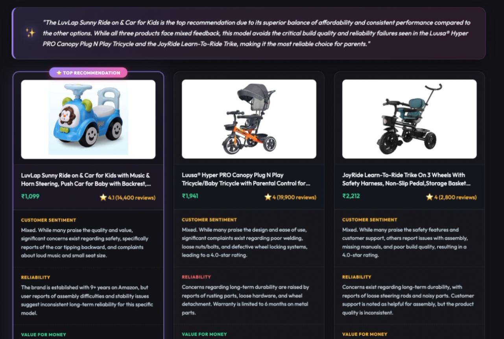

---

### 3. Dropdown-Based Sort Selections

#### Initial State
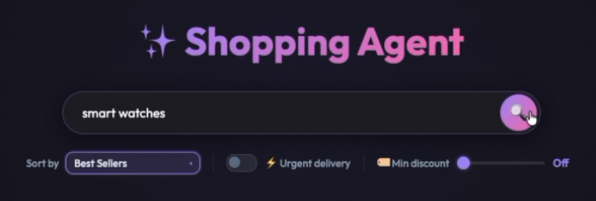

#### Execution Log & DAG

#### Session Log: s9-2026-06-13_06-01-31

##### 1. Original User Goal
> smart watches. Additional filters: sort by "Best Sellers".

##### 2. Planner DAG
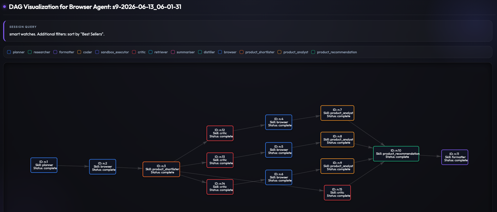

##### 3. Browser Path Chosen
The Browser cascade chose the **VISION** interaction path.

##### 4. Browser Actions & Screenshots

###### Turn 1
**Thinking:** 

**Actions:**
- `click(mark=99)`
- `click(mark=47)`

**Outcome:** `ok | selected option 'Sell'`

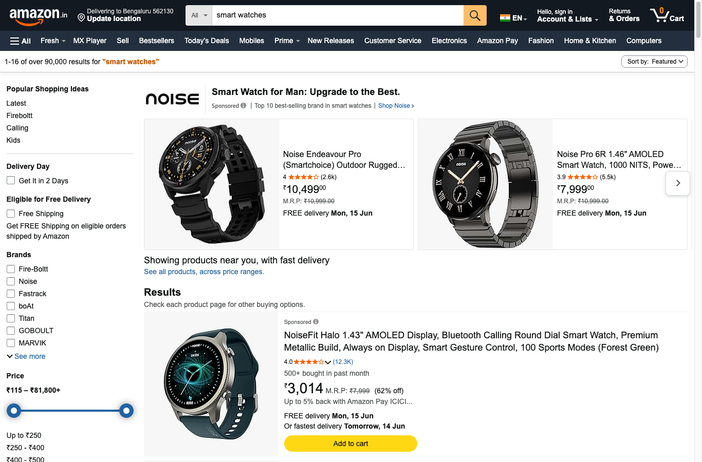

###### Turn 2
**Thinking:** 

**Actions:**
- `click(mark=99)`

**Outcome:** `ok`


###### Turn 3
**Thinking:** 

**Actions:**
- `click(mark=103)`

**Outcome:** `ok`


###### Turn 4
**Thinking:** 

**Actions:**
- `done(success=True, value=The search results are now sorted by Best Sellers.)`

**Outcome:** `done(True)`

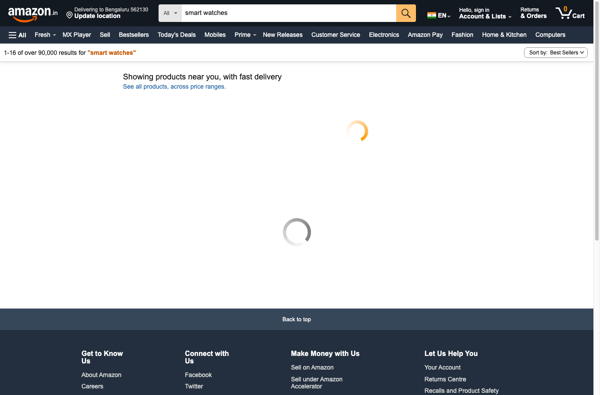

##### 5. Extracted Shortlist Data

```json
{
  "products": [
    {
      "id": "B0BF57RN3K",
      "title": "Fire-Boltt Ninja Call Pro Plus Bluetooth Calling Smart Watch, 1.83″ HD Display, AI Voice Assistant, 120+ Sports Modes, IP67 Waterproof, SpO2 & Heart Rate Monitor Smartwatch for Men & Women - Black",
      "price": "₹1,399",
      "rating": 3.9,
      "reviews_count": 130000,
      "image_url": "https://m.media-amazon.com/images/I/61rmkmqD5VL._AC_UY218_.jpg",
      "url": "https://www.amazon.in/dp/B0BF57RN3K"
    },
    {
      "id": "B0CG1Y3336",
      "title": "Noise Vortex Plus 1.46 AMOLED Display, AoD, BT Calling, Sleek Metal Finish, 7 Days Battery Life, All New OS with 100+ Watch Faces & Health Suite (Jet Black)",
      "price": "₹2,199",
      "rating": 4.0,
      "reviews_count": 56500,
      "image_url": "https://m.media-amazon.com/images/I/61QiBo-sPTL._AC_UY218_.jpg",
      "url": "https://www.amazon.in/dp/B0CG1Y3336"
    },
    {
      "id": "B0CQ4KTCH1",
      "title": "Noise Twist Go Round dial Smartwatch with BT Calling, 1.39\" Display, Metal Build, 100+ Watch Faces, IP68, Sleep Tracking, 100+ Sports Modes, 24/7 Heart Rate Monitoring (Jet Black)",
      "price": "₹1,299",
      "rating": 4.0,
      "reviews_count": 55100,
      "image_url": "https://m.media-amazon.com/images/I/61BoaOUf+KL._AC_UY218_.jpg",
      "url": "https://www.amazon.in/dp/B0CQ4KTCH1"
    }
  ]
}
```

##### 6. Browser path chosen for product analyst

###### Product detail lookup for [https://www.amazon.in/dp/B0BF57RN3K](https://www.amazon.in/dp/B0BF57RN3K) (ASIN: B0BF57RN3K)
- **Node ID:** `n:4`
- **Interaction Path:** **EXTRACT**

####### Extracted Content:
```text
Add to your order
[Onsitego 1 Year Extended Warranty for Smartwatches from Rs.1001-1500 (Email Delivery - No Physical Kit)](/dp/B0C2J5XXLG/ref=dp_atch_dss_w_lm_B0BF57RN3K_B0C2J5XXLG)
from Onsite Electro Services Private Limited ₹129.00
- EMAIL DELIVERY ONLY: Download your extended warranty certificate by sharing your device details. The link is available under buyer/seller messages at www.amazon.in/msg and is also sent to your Amazon registered email ID
- REPAIR OR REPLACEMENT GUARANTEE: We will either repair your device or give a replacement. The replacement device will be provided at the discretion of Onsitego on the basis of the depreciated value of your device
- HASSLE-FREE SERVICE: ‘No Questions Asked’ Repair Policy | Zero-Paperwork Claims Process | Free Pick & Drop or At-Home Service
- LIMIT OF LIABILITY: Onsitego liability is limited to the depreciated value of the device as detailed in our T&C document
- HIGH-QUALITY REPAIRS: Service by Onsitego authorised service engineers with high-quality spare parts every single time.
- EASY TO REQUEST SERVICE: Download the Onsitego app to raise a repair request within 10 seconds or visit our website. You can also call us or chat with us on 99205 99206
- COVERAGE: The plan covers all defects & malfunctions under the original manufacturer’s warranty. The plan starts the day after the manufacturer’s warranty ends or on the 366th day from the date of device purchase, whichever is later. It does not cover physical or liquid damage, ac

... (truncated for length)
```

###### Product detail lookup for [https://www.amazon.in/dp/B0CG1Y3336](https://www.amazon.in/dp/B0CG1Y3336) (ASIN: B0CG1Y3336)
- **Node ID:** `n:5`
- **Interaction Path:** **EXTRACT**

####### Extracted Content:
```text
Add to your order
[Onsitego 1 Year Extended Warranty for Smartwatches from Rs. 2001-2500 (Email Delivery - No Physical Kit)](/dp/B0C2J47SMC/ref=dp_atch_dss_w_lm_B0CG1Y3336_B0C2J47SMC)
from Onsite Electro Services Private Limited ₹175.00
- EMAIL DELIVERY ONLY: Download your extended warranty certificate by sharing your device details. The link is available under buyer/seller messages at www.amazon.in/msg and is also sent to your Amazon registered email ID
- REPAIR OR REPLACEMENT GUARANTEE: We will either repair your device or give a replacement. The replacement device will be provided at the discretion of Onsitego on the basis of the depreciated value of your device
- HASSLE-FREE SERVICE: ‘No Questions Asked’ Repair Policy | Zero-Paperwork Claims Process | Free Pick & Drop or At-Home Service
- LIMIT OF LIABILITY: Onsitego liability is limited to the depreciated value of the device as detailed in our T&C document
- HIGH-QUALITY REPAIRS: Service by Onsitego authorised service engineers with high-quality spare parts every single time.
- EASY TO REQUEST SERVICE: Download the Onsitego app to raise a repair request within 10 seconds or visit our website. You can also call us or chat with us on 99205 99206
- COVERAGE: The plan covers all defects & malfunctions under the original manufacturer’s warranty. The plan starts the day after the manufacturer’s warranty ends or on the 366th day from the date of device purchase, whichever is later. It does not cover physical or liquid damage, a

... (truncated for length)
```

###### Product detail lookup for [https://www.amazon.in/dp/B0CQ4KTCH1](https://www.amazon.in/dp/B0CQ4KTCH1) (ASIN: B0CQ4KTCH1)
- **Node ID:** `n:6`
- **Interaction Path:** **EXTRACT**

####### Extracted Content:
```text
Add to your order
[Onsitego 1 Year Extended Warranty for Smartwatches from Rs.1001-1500 (Email Delivery - No Physical Kit)](/dp/B0C2J5XXLG/ref=dp_atch_dss_w_lm_B0CQ4KTCH1_B0C2J5XXLG)
from Onsite Electro Services Private Limited ₹129.00
- EMAIL DELIVERY ONLY: Download your extended warranty certificate by sharing your device details. The link is available under buyer/seller messages at www.amazon.in/msg and is also sent to your Amazon registered email ID
- REPAIR OR REPLACEMENT GUARANTEE: We will either repair your device or give a replacement. The replacement device will be provided at the discretion of Onsitego on the basis of the depreciated value of your device
- HASSLE-FREE SERVICE: ‘No Questions Asked’ Repair Policy | Zero-Paperwork Claims Process | Free Pick & Drop or At-Home Service
- LIMIT OF LIABILITY: Onsitego liability is limited to the depreciated value of the device as detailed in our T&C document
- HIGH-QUALITY REPAIRS: Service by Onsitego authorised service engineers with high-quality spare parts every single time.
- EASY TO REQUEST SERVICE: Download the Onsitego app to raise a repair request within 10 seconds or visit our website. You can also call us or chat with us on 99205 99206
- COVERAGE: The plan covers all defects & malfunctions under the original manufacturer’s warranty. The plan starts the day after the manufacturer’s warranty ends or on the 366th day from the date of device purchase, whichever is later. It does not cover physical or liquid damage, ac

... (truncated for length)
```


##### 7. Final Recommendation Matrix


Product | Price | Rating | CUSTOMER SENTIMENT | RELIABILITY | VALUE FOR MONEY | FEATURE COMPLETENESS | BUILD QUALITY
--- | --- | --- | --- | --- | --- | --- | ---
**[Noise Twist Go Round dial Smartwatch with BT Calli...](https://www.amazon.in/dp/B0CQ4KTCH1)** | ₹1,299 | 4.0 (55,100 reviews) | **[NEUTRAL]** Mixed sentiment with a 4.0-star rating. Users praise the stylish design, calling features, and battery life, but some report hardware failures and poor strap quality. | **[NEUTRAL]** Concerns exist regarding long-term durability; some users reported the device failing to charge or turn on after a few months. Includes a 1-year manufacturer warranty. | **[POSITIVE]** Priced at ₹1,299, users generally consider it a good budget option for basic health tracking and calling features, though build quality is a point of contention. | **[POSITIVE]** Includes standard features like BT calling, heart rate/SpO2 monitoring, 100+ sports modes, and voice assistance. Lacks built-in GPS, which is common in this price segment. | **[NEUTRAL]** Features a metal build and round dial which users find stylish. However, some reviews criticize the strap as low-quality and the charging cable as feeling cheap.
**[Noise Vortex Plus 1.46 AMOLED Display, AoD, BT Cal...](https://www.amazon.in/dp/B0CG1Y3336)** | ₹2,199 | 4.0 (56,500 reviews) | **[NEUTRAL]** Reviews are mixed; users praise the AMOLED display and metal finish, but some report inaccurate health sensors and dissatisfaction with premium subscription requirements for custom watch faces. | **[NEUTRAL]** The product includes a 1-year manufacturer warranty and a 10-day service center replacement policy. Some users reported sensor malfunctions shortly after purchase. | **[NEUTRAL]** Priced at 2,199, users generally find it a decent entry-level upgrade, though some feel the need for paid subscriptions to access features diminishes the overall value. | **[NEUTRAL]** Includes Bluetooth calling, 110+ sports modes, and health tracking. Notable omissions include built-in GPS and some features are locked behind a premium subscription. | **[POSITIVE]** Features a sleek metal finish and a 1.46-inch AMOLED display. Reviewers generally describe the build as premium and sturdy, noting it feels better than typical plastic gadgets.
**[Fire-Boltt Ninja Call Pro Plus Bluetooth Calling S...](https://www.amazon.in/dp/B0BF57RN3K)** | ₹1,399 | 3.9 (130,000 reviews) | **[NEUTRAL]** Mixed. While some users praise the style and features, many report significant issues with step/sleep tracking accuracy, Bluetooth connectivity, battery life, and poor app experience. | **[NEGATIVE]** Negative. Multiple reports of defective units, hardware failures (bubbles/coatings), and difficult warranty/service center experiences, with some users needing to travel long distances for support. | **[NEUTRAL]** Neutral. Priced at ₹1,399, it offers many features, but users frequently describe it as a 'toy' or poor quality, questioning its worth despite the low price point. | **[POSITIVE]** Positive. The watch is feature-rich, including Bluetooth calling, 120+ sports modes, SpO2/heart rate monitoring, and voice assistant, covering most standard requirements for this category. | **[NEGATIVE]** Negative. Users report poor strap quality, screen sensitivity issues, and physical defects like improperly drilled lug holes and bubbling on the casing, indicating inconsistent manufacturing.

**Overall Agent Recommendation Summary:**
> The Noise Twist Go Round dial Smartwatch is the top recommendation due to its superior balance of value and feature completeness compared to the other options. While the Noise Vortex Plus offers a better display, the Noise Twist Go provides a more reliable budget-friendly experience without the negative build quality issues reported with the Fire-Boltt Ninja Call Pro Plus.

##### 8. Cost & Performance Summary

| Node ID | Skill | Provider | Model | Latency | Tokens In | Tokens Out |
|---|---|---|---|---|---|---|
| n:1 | planner | gemini_lite_4 | gemini-3.1-flash-lite | 3,430ms | 4,686 | 697 |
| n:2 | browser | gemini_lite_4, gemini_lite_5, gemini_lite_6 | gemini-3.1-flash-lite | 49,227ms | 380,538 | 2,570 |
| n:3 | product_shortlister | gemini_lite_4, gemini_lite_5, gemini_lite_6, gemini_lite_7 | gemini-3.1-flash-lite | 2,209ms | 31,940 | 786 |
| n:4 | browser | gemini_lite_4, gemini_lite_5, gemini_lite_6, gemini_lite_7 | gemini-3.1-flash-lite | 1,972ms | 121,781 | 1,041 |
| n:5 | browser | gemini_lite_4, gemini_lite_5, gemini_lite_6, gemini_lite_7 | gemini-3.1-flash-lite | 2,195ms | 121,781 | 1,041 |
| n:6 | browser | gemini_lite_4, gemini_lite_5, gemini_lite_6, gemini_lite_7 | gemini-3.1-flash-lite | 2,443ms | 121,781 | 1,041 |
| n:7 | product_analyst | gemini_lite_5, gemini_lite_6, gemini_lite_7 | gemini-3.1-flash-lite | 2,256ms | 120,076 | 994 |
| n:8 | product_analyst | gemini_lite_5, gemini_lite_6, gemini_lite_7 | gemini-3.1-flash-lite | 1,722ms | 120,076 | 994 |
| n:9 | product_analyst | gemini_lite_5, gemini_lite_6, gemini_lite_7 | gemini-3.1-flash-lite | 2,192ms | 120,076 | 994 |
| n:10 | product_recommendation | gemini_lite_4, gemini_lite_5, gemini_lite_6, gemini_lite_7 | gemini-3.1-flash-lite | 4,208ms | 126,127 | 2,856 |
| n:11 | formatter | gemini_lite_4 | gemini-3.1-flash-lite | 1,631ms | 6,051 | 1,862 |
| n:12 | critic | gemini_lite_4 | gemini-3.1-flash-lite | 995ms | 1,705 | 47 |
| n:13 | critic | gemini_lite_4 | gemini-3.1-flash-lite | 1,165ms | 1,705 | 47 |
| n:14 | critic | gemini_lite_4 | gemini-3.1-flash-lite | 1,124ms | 1,705 | 47 |
| n:15 | critic | gemini_lite_4, gemini_lite_5, gemini_lite_6, gemini_lite_7 | gemini-3.1-flash-lite | 183,519ms | 29,940 | 739 |
| **TOTAL** | | | | **260,288ms** | **1,309,968** | **15,756** |


#### Final Output State
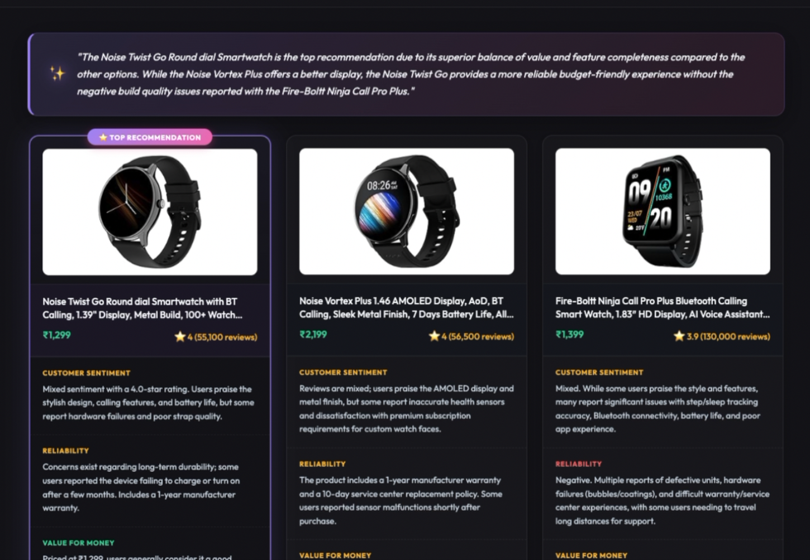
